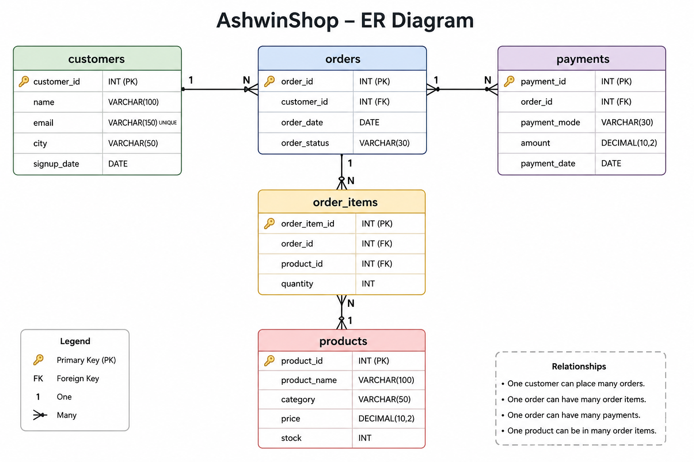

# E-Commerce-Database-Design
E-commerce SQL database project demonstrating relational database design and business analysis using MySQL, including customer, product, order, payment, sales, and advanced SQL queries.

# 🛒 AshwinShop — E-Commerce SQL Database & Analysis

## 📌 Project Overview

**AshwinShop** is a relational SQL database project designed to simulate the backend data of a small e-commerce business.

The project contains customer, product, order, order item, and payment information. Along with database design, the project includes SQL queries that answer practical business questions related to customers, products, sales, revenue, and orders.

The goal of this project is to demonstrate practical SQL skills and the ability to use relational data for business analysis.

---

## 🗂️ Database Structure

The database consists of five interconnected tables:

| Table         | Description                              |
| ------------- | ---------------------------------------- |
| `customers`   | Stores customer information              |
| `products`    | Stores product and inventory information |
| `orders`      | Stores customer orders                   |
| `order_items` | Stores products included in each order   |
| `payments`    | Stores payment information for orders    |

### 🔗 Relationships

* One customer can place multiple orders.
* One order can contain multiple order items.
* Each order item is associated with one product.
* Orders are associated with payment records.

---

## 🛠️ Technologies Used

* **MySQL**
* **SQL**
* Relational Database Design

---

## 📊 ER Diagram



---

## 📁 Repository Structure

```text
AshwinShop/
│
├── README.md
│
├── database/
│   ├── 01_create_database.sql
│   ├── 02_create_tables.sql
│   └── 03_insert_data.sql
│
├── analysis/
│   ├── 01_basic_analysis.sql
│   ├── 02_customer_analysis.sql
│   ├── 03_product_analysis.sql
│   ├── 04_sales_analysis.sql
│   └── 05_advanced_analysis.sql
│
├── documentation/
│   └── ER_Diagram.png
│
└── screenshots/
    └── query_results/
```

---

## 🔍 Business Questions

The SQL analysis explores questions such as:

* How many customers are registered?
* Which cities have the most customers?
* Which customers place the most orders?
* Which customers generate the highest revenue?
* Which products sell the most?
* Which categories generate the most revenue?
* Which products have low inventory?
* What is the total revenue generated?
* What is the average order value?
* How are customers ranked based on spending?

---

## 📈 SQL Concepts Demonstrated

This project demonstrates practical use of:

* `SELECT`
* `WHERE`
* `ORDER BY`
* `GROUP BY`
* `HAVING`
* Aggregate functions
* `INNER JOIN`
* `LEFT JOIN`
* Subqueries
* CTEs
* Window functions
* `CASE`
* `RANK()`
* Business-oriented SQL analysis

---

## 🎯 Project Objective

The main objective of AshwinShop is to build practical experience with relational databases and SQL while applying SQL to real-world e-commerce business questions.

This project is part of my journey toward developing strong skills in **Data Analytics, SQL, and Business Intelligence**.

---

## 👨‍💻 Author

**Ashwin Goel**

B.Tech — Computer Science & Engineering (Data Science)

---

⭐ If you find this project useful, feel free to explore the SQL analysis and database design.
